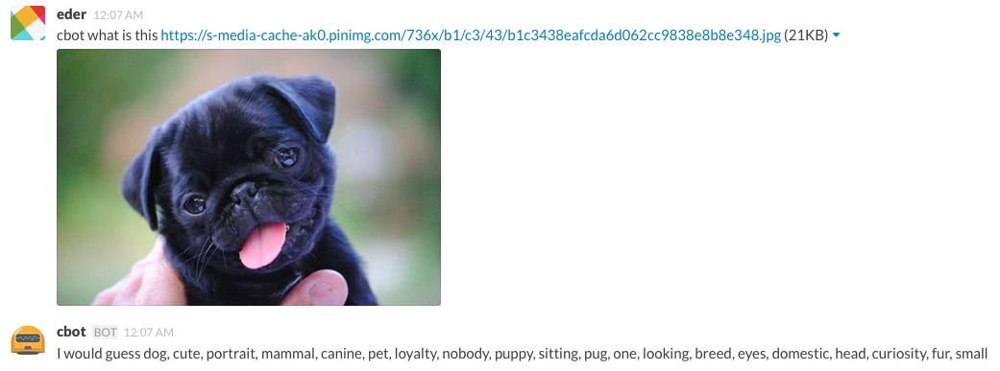

# hubot-recognizer

A hubot script that interacts with Clarifai's API to recognize images.



## Installation

1. Register an app on [Clarifai]('https://developer.clarifai.com/docs/'). Yup! They have
a free tier.

2. Get your client id and secret in the step above and export them as
   environment variables `CLIENT_ID` and `CLIENT_SECRET`:

`export CLIENT_ID=HugeCR4zyV4luesTh3yW1!!g1veU`

3. In hubot project repo, run:

`npm install hubot-recognizer --save`

Then add **hubot-recognizer** to your `external-scripts.json`:

```json
[
  "hubot-recognizer"
]
```

## Usage
[robot] what is this [image url]

## TODO
- [ ] Checkout video analysis API
